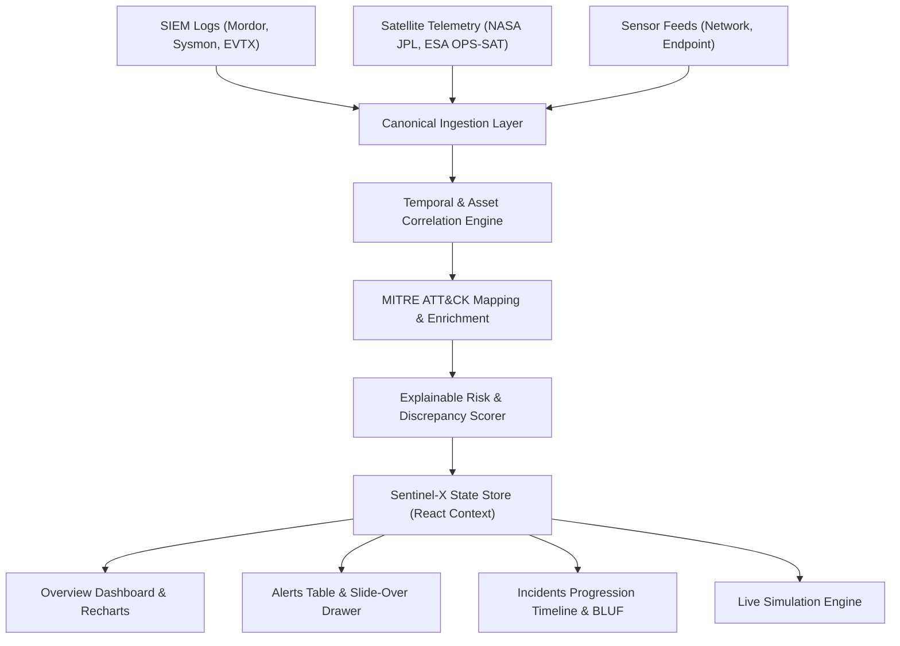

# Architecture

## System Architecture

Sentinel-X is organized into an event streaming and correlation architecture that processes multi-domain data sources and visualizes threat intelligence via a responsive SaaS frontend.

## Components

| Component | Technology | Responsibility |
|---|---|---|
| Frontend UI | React 19, Tailwind CSS v4, Lucide | Responsive SaaS dashboard, alert triage table, and slide-overs |
| Analytics & Charts | Recharts 3 | Threat activity timeline, priority distribution, telemetry curves |
| Correlation Engine | TypeScript / State Engine | Multi-source event grouping, asset mapping, temporal windowing |
| Intelligence Enrichment | MITRE ATT&CK Enterprise Matrix | Tactic and technique mapping with detection signatures |
| Simulation Engine | React Custom Hooks & Timers | Real-time synthetic event generation with rate throttling |
| Edge Hosting | Netlify Edge CDN & SPA Rewrites | High-availability global deployment and instant client routing |

## Data Flow

1. **Ingestion:** Security events are received from SIEM, space telemetry, or synthetic simulator.
2. **Normalization:** Events are mapped to canonical fields (`timestamp`, `sourceId`, `asset`, `indicator`, `eventType`, `domain`).
3. **Correlation:** Events affecting identical assets (`HOST-042`) within the 15-minute window are linked into incident campaigns.
4. **Behavioral Mapping:** Event signatures are tagged with MITRE ATT&CK technique IDs (e.g. `T1059.001`).
5. **Risk Assessment:** The scoring engine computes a 0-100 risk score, identifies discrepancy with source severity, and produces actionable triage recommendations.

## Security & Operational Policy

- **Operational Telemetry Isolation:** Satellite telemetry deviations are tracked as operational telemetry anomalies and strictly isolated from cyberattack alerts unless corroborated by cyber indicators.
- **Client Security:** All state is handled in-memory without persistent local credential exposure; SPA redirect rules enforce clean routing.
