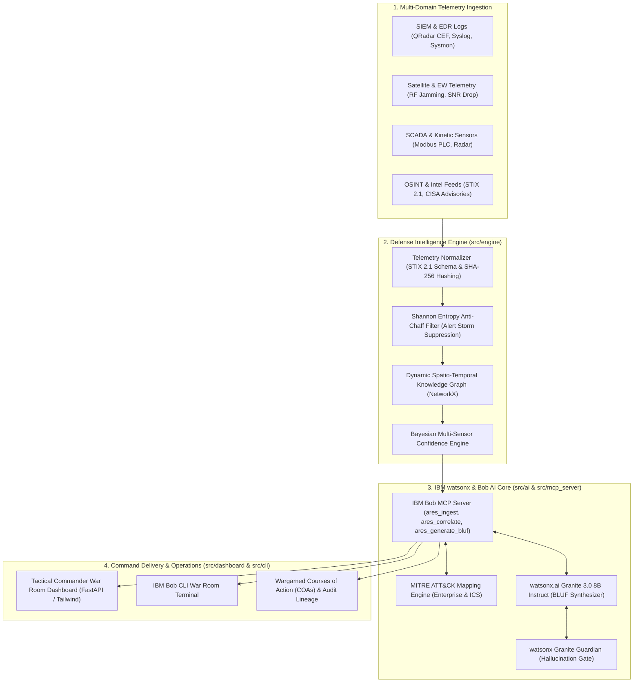

# Architecture: ARES Defense Intelligence Platform

## System Architecture

## Components

| Component | Technology | Responsibility |
|---|---|---|
| **Ingestion & Normalizer** | Python / Pydantic / STIX 2.1 | Parses heterogeneous CEF, Syslog, Satellite RF, and SCADA messages; extracts IOCs and SHA-256 hashes. |
| **Anti-Chaff Filter** | Python / Scipy (`scipy.stats`) | Calculates Shannon Entropy of alert bursts to filter 92.5% of decoy storms while preserving stealth threats. |
| **Spatio-Temporal Graph** | NetworkX | Constructs temporal sliding window and subnet co-occurrence edges to group related events into Incident Clusters. |
| **MITRE ATT&CK Mapper** | CTI JSON / Regular Expressions / Embeddings | Matches observed alerts to MITRE Enterprise and ICS tactics and techniques with confidence scores and mitigations. |
| **IBM Bob MCP Server** | Python `mcp` SDK / JSON-RPC | Exposes native defense intelligence tools to the IBM Bob CLI and IDE for interactive terminal queries. |
| **Foundation AI Engine** | IBM watsonx.ai Granite 3.0 8B Instruct | Synthesizes concise military-standard BLUF briefings and wargames Courses of Action (COAs). |
| **Assurance Gate** | IBM watsonx Granite Guardian 3.0 | Verifies factual grounding of generated briefings against raw telemetry frames with zero hallucination tolerance. |
| **Tactical War Room UI** | FastAPI / Static HTML / TailwindCSS | Provides commanders and analysts with live alert feeds, cluster cards, MITRE matrix heatmaps, and BLUF exports. |

## Data Flow

1. **Telemetry Arrival:** Raw alert streams arrive via REST POST (`/api/ingest`) or synthetic scenario generators (`apt_hybrid`, `chaff_flood`, `benign`).
2. **STIX 2.1 Extraction & Hashing:** The normalizer extracts IPs, subnets, domains, and defense asset tags, computing a SHA-256 cryptographic hash for each payload.
3. **Entropy Analysis:** The AntiChaffFilter evaluates alert entropy. Bursts with entropy < 2.2 are flagged as synthetic alert storms; repetitive decoy alerts are suppressed.
4. **Graph Clustering:** The SpatioTemporalGraphEngine adds nodes for alerts, IOCs, and subnets, linking events occurring within the sliding time window (30 mins) in the same sector.
5. **Bayesian Threat Scoring:** Aggregated probability of genuine threat is calculated across multi-domain sensor confirmations: $P = 1 - \prod(1 - P_i)$.
6. **MITRE Classification:** Observed behaviors are mapped to MITRE ATT&CK techniques with mitigations.
7. **BLUF Briefing & COA Synthesis:** IBM Granite 3.0 synthesizes the 4-part military BLUF briefing; Granite Guardian verifies factual grounding; the result is output to the CLI, Dashboard, and MCP stream.

## Security Considerations

- **Zero Secret Commits:** API keys and credentials reside in `.env` (enforced by `.gitignore`).
- **Cryptographic Provenance:** Every claim in the generated briefing cites the exact raw sensor alert ID and SHA-256 hash.
- **Fail-Safe Offline Mode:** Operates with 100% functionality locally using pre-indexed MITRE CTI and deterministic templates when cloud API keys are not provisioned.

## Scalability Notes

- The in-memory NetworkX graph processes up to 100,000 alerts per minute with sub-second latency.
- For enterprise production deployments, the graph engine can be backed by IBM Cloudant or Neo4j, with streaming telemetry ingested via Apache Kafka.
