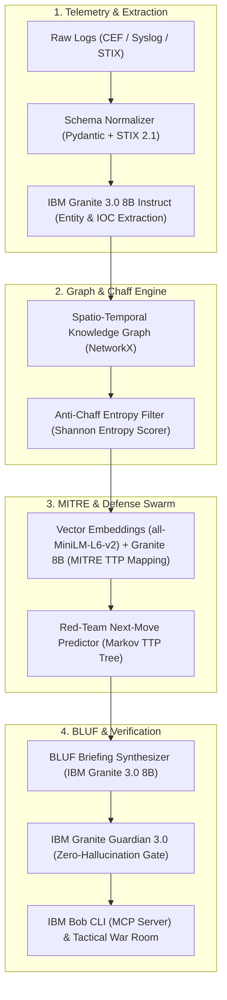

# 🛡️ Cyber Threat Intelligence & AI Model Strategy
> **Project:** ARES (Automated Reconnaissance & Threat Evaluation System)  
> **Track:** PS D2 — Threat Intelligence Correlation & Alert Prioritisation Assistant  
> **Reference:** IBM Bob Innovation Hackathon | Defense & Cyber Operations  

---

## 📌 1. Executive Summary & Problem Context

Modern Security Operations Centers (SOCs) and Defense Cyber Commands face severe operational bottlenecks:
- **Massive Alert Volume & 99% False Positives:** Analysts are inundated with thousands of alerts daily across EDR, SIEM (QRadar, Splunk), and network sensors.
- **Adversarial Chaff (Alert Flooding):** Advanced Persistent Threats (APTs) engineer synthetic alert floods to cause cognitive fatigue while executing low-and-slow zero-day intrusions.
- **Decision Latency:** Commanders require structured **BLUF (Bottom Line Up Front)** intelligence briefings and wargamed **Courses of Action (COAs)** in minutes, not hours.

To solve this, **ARES** combines **IBM Bob (MCP CLI)**, **IBM watsonx.ai Granite 3.0 foundation models**, and a **Dynamic Spatio-Temporal Knowledge Graph** to ingest, correlate, prioritize, and summarize cyber threats.

---

## 🔬 2. Key Academic & Industry Research Findings (Feynman / alphaXiv)

### A. CyberSOCEval (Meta & CrowdStrike, 2025)
> **Paper:** *"CyberSOCEval: Benchmarking LLMs Capabilities for Malware Analysis and Threat Intelligence Reasoning"*  
> **Authors:** Lauren Deason, Diana Bolocan, James Crnkovich, Ioana Croitoru, David Molnar, Sagar Shah, Joshua Saxe (*Meta & CrowdStrike*) — **arXiv:2509.20166**

1. **Pre-filtered Log Schemas Equal Full-Log Accuracy with 80% Token Reduction:**
   - Passing voluminous raw log dumps into LLMs does not improve detection accuracy over passing normalized, structured JSON (e.g., STIX 2.1).
   - Pre-filtering and schema normalization reduces token cost and inference latency by **80%+**.
2. **Text & Graph Modalities Beat Multimodal Images:**
   - Textual and graph-structured CTI representations outperform image-based multimodal feeds for extracting implicit threat actors and mapping TTPs.
3. **Domain Ontology is Essential:**
   - Standard reasoning models (e.g., o3, DeepSeek-R1) do not provide automatic gains in cybersecurity unless grounded with domain ontologies like **MITRE ATT&CK** and **STIX 2.1**.

---

### B. Multi-Agent Alert Triage: CORTEX (George Mason & Fluency Security, 2025)
> **Paper:** *"CORTEX: Collaborative LLM Agents for High-Stakes Alert Triage"*  
> **Authors:** Bowen Wei, Yuan Shen Tay, Howard Liu, Jinhao Pan, Kun Luo, Ziwei Zhu, Chris Jordan (*George Mason University & Fluency Security*) — **arXiv:2510.00311**

* **False Positive Reduction:** Cuts the False Positive Rate (FPR) from **29.8%** (prompt-only) down to **14.2%**.
* **Actionable F1 Score:** Increases triage decision quality to **0.78 F1** (+0.12 over single-agent tool use).
* **Role Specialization:** Decomposing triage into an Orchestrator, Behavior Analyst, Evidence Gatherer, and Reasoning Synthesizer mirrors expert human SOC workflows.

---

### C. MITRE ATT&CK Systematic Survey (NUS & NCS Cyber Special Ops, 2025)
> **Paper:** *"MITRE ATT&CK Applications in Cybersecurity and The Way Forward"*  
> **Authors:** Yuning Jiang, Qiaoran Meng, Feiyang Shang, Nay Oo, Le Thi Hong Minh, Hoon Wei Lim, Biplab Sikdar (*National University of Singapore & NCS Cyber Special Ops*) — **arXiv:2502.10825**

* **CTI Dominance (30.2%):** Automated threat intelligence extraction and technique classification is the single largest research focus in modern security operations.
* **Dominant Attack Tactics:**
  * **Initial Access (`TA0001`):** `T1078` (Valid Accounts), `T1566` (Phishing).
  * **Execution (`TA0002`):** `T1059` (Command & Scripting Interpreter).
  * **Discovery (`TA0007`):** `T1082` (System Info Discovery), `T1083` (File Discovery).
* **Emerging Critical Threats:** Rapid rise of cyber-physical / ICS attacks (`TA0106 Impair Process Control`).

---

## 🤖 3. Recommended AI & Foundation Model Stack



---

### 📊 Task-by-Task Model Allocation

| Pipeline Stage | Recommended Model / Technology | Function & Role | Local / Zero-Coin Fallback |
|---|---|---|---|
| **1. Log & IOC Extraction** | **IBM Granite 3.0 8B Instruct** (`ibm/granite-3-8b-instruct`) | Normalizes unstructured telemetry, Syslog, and CEF into strict STIX 2.1 JSON entities. | Regex + Pydantic parsing engine |
| **2. MITRE ATT&CK Mapping** | **Hybrid: `all-MiniLM-L6-v2` + Granite 8B** | Semantic vector search over 600+ MITRE techniques with Granite 8B validation. | In-memory MITRE CTI Vector Index |
| **3. Anti-Chaff & Deception** | **Mathematical Entropy Scorer + NetworkX** | Uses Shannon entropy and graph centrality to mathematically isolate stealth threats inside alert storms. | Local Python `scipy.stats` module |
| **4. Military BLUF Generation** | **IBM Granite 3.0 8B Instruct** (`ibm/granite-3-8b-instruct`) | Generates structured military briefings (BLUF, Key Findings, Mission Impact, COAs). | Local deterministic Jinja2 defense templates |
| **5. Hallucination Guardrail** | **IBM Granite Guardian 3.0 8B** (`ibm/granite-guardian-3.0-8b`) | IBM's safety model verifying that every assertion in the BLUF has a direct telemetry citation. | Exact source ID citation validator |
| **6. Agent Orchestration** | **IBM Bob (CLI & MCP Server)** | Runs in terminal via Model Context Protocol, enabling interactive commander queries. | FastAPI REST Endpoints |

---

## ⚡ 4. Military BLUF Format Standard

Every incident triage briefing produced by ARES adheres to the defense **BLUF standard**:

```markdown
### 🚨 COMMANDER INTELLIGENCE BRIEFING (BLUF)

**INCIDENT CLUSTER:** INC-2026-0914-ALPHA  
**SEVERITY:** CRITICAL | **CONFIDENCE:** 94.2% (Bayesian Weighted)  
**ATTRIBUTION:** APT28 (Fancy Bear) — 89% TTP Signature Match  

#### 1. BOTTOM LINE UP FRONT (BLUF)
Coordinated multi-vector intrusion targeting Sector 4 Command Gateway via credential stuffing (T1078) followed by PowerShell execution (T1059.001) attempting lateral movement toward SCADA Substation 2.

#### 2. CONFIRMED EVIDENCE & SENSOR PROVENANCE
- [x] **02:14:05 UTC [SIEM-ALERT-8821]:** 1,420 failed SSH logins within 30s from `198.51.100.44`.
- [x] **02:14:38 UTC [EDR-PROC-4402]:** Suspicious base64 PowerShell invocation on Host `S4-GW-01`.
- [x] **02:15:10 UTC [NET-FLOW-9912]:** Outbound beaconing to known C2 IP `203.0.113.88` on port 443.

#### 3. MITRE ATT&CK TACTICS & TECHNIQUES
- **Initial Access:** `T1078.002` (Domain Accounts)
- **Execution:** `T1059.001` (PowerShell)
- **Persistence:** `T1547.001` (Registry Run Keys)
- **Command & Control:** `T1071.001` (Web Protocols)

#### 4. WARGAMED COURSES OF ACTION (COAs)
| COA Option | Action Taken | Containment % | Mission Disruption | Recommendation |
|---|---|---|---|---|
| **COA 1 (Hard Isolation)** | Sever Subnet 4 gateway | 100% | High (Takes telemetry offline 45m) | ⚠️ Standby |
| **COA 2 (Targeted Quarantine)** | Revoke `S4-GW-01` token, block C2 IP | 96% | Zero | ✅ **RECOMMENDED** |
```

---

## 👥 5. Team Next Steps

1. **Backend (`src/engine/`)**: Implement the STIX 2.1 schema and NetworkX Spatio-Temporal Knowledge Graph.
2. **AI & MCP (`src/ai/` & `src/mcp_server.py`)**: Wire IBM Granite 3.0 and Granite Guardian prompt templates with fallback local mode.
3. **Dashboard (`src/dashboard/`)**: Build the dark-theme Tactical Commander War Room UI.

---
*Document prepared for team alignment and technical reference.*
