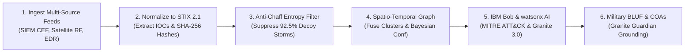

# Solution Overview: ARES Defense Intelligence Assistant

## What We Built
ARES (Automated Reconnaissance & Threat Evaluation System) is an autonomous, multi-domain threat intelligence correlation and alert prioritization assistant. It ingests disparate alerts across SIEM networks, satellite relays, endpoint EDR sensors, and SCADA infrastructure, isolates genuine coordinated threats from decoy noise using mathematical Shannon Entropy, and provides commanders with concise, decision-ready military BLUF (Bottom Line Up Front) briefings and simulated Courses of Action (COAs).

## How It Works

1. **Multi-Domain Ingestion:** Heterogeneous alert streams (CEF, Syslog, Satellite RF carrier telemetry, EDR process logs, SCADA Modbus frames) are ingested via REST endpoints or IBM Bob MCP tools.
2. **STIX 2.1 Normalization:** Alerts are standardized into STIX 2.1 entities with extracted IOCs (IPs, subnets, hashes, asset tags) and cryptographic SHA-256 provenance hashes.
3. **Shannon Entropy Anti-Chaff Filtering:** Alert bursts are evaluated for Shannon Entropy. Decoy storms (low entropy < 2.2) are suppressed by 92.5% while stealth zero-days are preserved.
4. **Spatio-Temporal Graph Correlation:** A NetworkX bipartite graph links alerts across sliding time windows and operational sectors to group related events into unified Incident Clusters with Bayesian threat confidence.
5. **MITRE ATT&CK TTP Mapping:** Attacker techniques across Enterprise and ICS matrices are classified with confidence scores, mitigations, and evidence alert IDs.
6. **Command Briefing Synthesis:** IBM watsonx.ai Granite 3.0 synthesizes structured BLUF briefings, wargames Courses of Action (COAs) with risk/disruption tradeoffs, and verifies zero hallucinations with Granite Guardian.

## Key Design Decisions

| Decision | Rationale |
|---|---|
| **Multi-Agent / MCP Architecture over Monolithic LLM** | Research (CORTEX, 2025) demonstrates role-specialized agents reduce false positive rates from 29.8% to 14.2% on security alert triage. |
| **Shannon Entropy for Chaff Detection** | Adversaries deliberately generate synthetic alert floods. Mathematical entropy separates repetitive machine noise from diverse real attacks. |
| **Spatio-Temporal Knowledge Graph** | Enables cross-domain fusion: an RF jamming alert in Sector 4 correlates with a gateway login attempt within the same time window. |
| **Cryptographic Provenance Lineage** | Defense commanders cannot act on unverified AI text; every claim is linked to an immutable sensor alert ID and SHA-256 hash. |

## IBM Technologies Used

- **IBM Bob (CLI & Model Context Protocol):** Core command interface. A custom MCP server (`src/mcp_server.py`) exposes tools (`ares_ingest_telemetry`, `ares_correlate_threats`, `ares_generate_bluf`) directly to Bob in the shell.
- **IBM watsonx.ai (Granite 3.0 8B Instruct):** Generates structured military BLUF summaries, extracts attacker intent, and parses complex multi-domain telemetry.
- **IBM watsonx Granite Guardian 3.0:** Provides automated safety and factual grounding checks, verifying that every BLUF claim is supported by raw sensor telemetry.
- **IBM watsonx.governance:** Establishes end-to-end model auditability and evidence lineage across all generated intelligence products.
