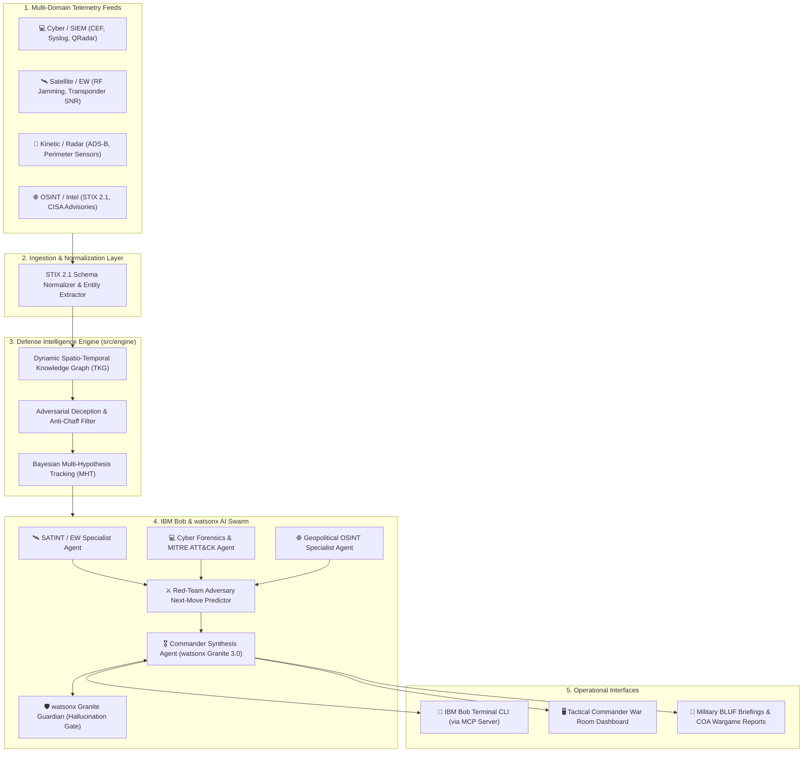

# 🛡️ Project ARES: AI-Powered Multi-Domain Threat Correlation & Alert Prioritisation Assistant
> **Track:** PS D2 — Threat Intelligence Correlation & Alert Prioritisation Assistant (Critical Now)  
> **Target:** IBM Bob Innovation Hackathon  
> **Team Alignment & Architecture Strategy Document**

---

## 📌 1. Executive Overview & Problem Context

### The Challenge
Defence analysts and command centers receive **tens of thousands of alerts daily** spanning disparate domains:
- **Cyber & SIEM systems** (QRadar, firewall logs, endpoint EDR, STIX/TAXII feeds)
- **Satellite & Electronic Warfare telemetry** (orbital transponder degradation, RF jamming, GPS spoofing)
- **Kinetic & Tactical sensors** (radar anomalies, ADS-B transponder dropouts, drone perimeters)
- **OSINT & Intelligence reports** (dark web chatter, CISA bulletins, adversary advisories)

### The Pain Point
1. **Cognitive Saturation & Alert Fatigue:** No human team can manually review thousands of heterogeneous alerts.
2. **Adversarial Chaff:** Sophisticated state-sponsored adversaries deliberately engineer synthetic alert floods (chaff) to disguise low-and-slow zero-day attacks.
3. **Command Latency:** Commanders need actionable, structured **BLUF (Bottom Line Up Front)** briefings and simulated **Courses of Action (COAs)** in *minutes*, not raw logs hours later.

### Our Solution
**ARES (Automated Reconnaissance & Threat Evaluation System)** — An agentic, multi-domain defense intelligence platform powered by **IBM Bob (MCP CLI)** and **IBM watsonx.ai (Granite 3.0)** that ingests multi-source feeds, filters adversarial chaff, builds a dynamic Spatio-Temporal Knowledge Graph, maps attacker TTPs to the MITRE ATT&CK matrix, and delivers verified, wargamed BLUF briefings to commanders.

---

## 🏛️ 2. System Architecture Blueprint



---

## 🚀 3. Key High-Scoring Features & Capabilities

### 1. Multi-Domain Cross-Correlation (Cyber + Space + Kinetic)
- Automatically correlates a GPS spoofing alert in Sector 4 with satellite link latency and a firewall brute-force attempt into a unified **Incident Cluster**.

### 2. Adversarial Anti-Chaff & Deception Filter
- Uses information entropy and temporal clustering to detect artificially engineered alert storms (decoy chaff) and isolates the high-priority stealth threat hidden underneath.

### 3. Automated MITRE ATT&CK Matrix & Heatmap
- Maps unstructured payload text to standard MITRE Enterprise & ICS/SCADA Tactics, Techniques, and Sub-technique IDs (e.g., `T1190`, `T1078`, `T1498`).
- Identifies active adversary profiles (e.g., APT28, Sandworm, Volt Typhoon).

### 4. Specialized Multi-Agent Intelligence Swarm
- **SATINT Agent:** Space and RF signal domain expert.
- **Cyber Forensics Agent:** STIX, network telemetry, and MITRE expert.
- **OSINT Agent:** Geopolitical context and dark web advisory expert.
- **Red-Team Agent:** Simulates the adversary's next 3 likely tactical moves using game-theoretic Markov trees.

### 5. Standardized Military BLUF Briefing Generator
- **Bottom Line Up Front (BLUF):** 1-sentence decisive summary.
- **Severity & Bayesian Confidence Score:** (e.g., *CRITICAL / 94.2% Confidence*).
- **Key Operational Findings:** Bulleted sensor evidence with raw telemetry IDs.
- **Mission Impact Assessment:** Direct operational consequences on bases, comms, and units.
- **Wargamed Courses of Action (COAs):** Compares defensive options with Risk vs. Mission Continuity tradeoff metrics.

### 6. IBM Bob MCP Server (Terminal War Room Assistant)
- Exposes native Model Context Protocol tools for IBM Bob CLI (`bob`):
  - `correlate_threat_feeds`
  - `generate_bluf_briefing`
  - `map_to_mitre_attack`
  - `simulate_coa_impact`

---

## 📦 4. Tech Stack Breakdown: Open-Source vs Custom-Built

| Component | Open-Source Libraries Reused | Custom Code Built by Team (`src/`) |
|---|---|---|
| **Threat Intelligence & Schemas** | `stix2` (OASIS Open), `mitreattack-python`, Official MITRE CTI JSON | Multi-domain normalization adapters (Cyber, Space, Kinetic, OSINT) |
| **Graph & Correlation** | `networkx` | Dynamic Spatio-Temporal Knowledge Graph & Bayesian Multi-Hypothesis tracker |
| **Noise & Chaff Filter** | `scipy`, `numpy` | Information Entropy Alert Burst suppression algorithm |
| **AI & Agent Orchestration** | `ibm-watsonx-ai`, `mcp` (Model Context Protocol SDK) | Multi-Agent Swarm logic, prompt chains, Granite Guardian verification |
| **Backend API** | `fastapi`, `uvicorn`, `pydantic` | REST API endpoints, incident cluster repository, cache layer |
| **Frontend & War Room** | React / Tailwind CSS / Lucide / Cytoscape.js | Military-grade dark tactical dashboard & interactive MITRE navigator |

---

## ⚡ 5. IBM Technology Mapping & Bobcoins Budget Strategy

### IBM Technology Allocation

| IBM Product | Usage in ARES | Hackathon Scoring Impact |
|---|---|---|
| **IBM Bob CLI & MCP** | Core interface for commanders & analysts in shell | **Criterion 5 (10 pts)**: Load-bearing Bob integration |
| **IBM watsonx.ai Granite 3.0** | Entity extraction, MITRE classification, BLUF synthesis | **Criterion 1 & 2 (50 pts)**: Technical quality & innovation |
| **IBM watsonx Granite Guardian** | Hallucination prevention gate & factual grounding | **Assurance & Reliability** for defense operations |
| **IBM watsonx.governance** | Cryptographic evidence citation & source lineage | **Explainable AI** (every claim linked to a sensor ID) |

### 🪙 Bobcoin Management Strategy (Total: 40 Coins per Member)
- **Local Dev First (0 Coins):** All engines, graph algorithms, and mock API tests run 100% locally during development.
- **Team Resource Pooling:** Each team member has 40 Bobcoins. We divide testing so no single account is drained.
- **IBM Cloud Account Request ($80 Free Credits):** The team lead requests the free $80 IBM Cloud account via [IBM Cloud Hackathon Request](https://www.ibm.com/account/reg/us-en/signup?formid=urx-54370) to access watsonx.ai Granite API keys without consuming Bobcoins.
- **Final Demo Run (~2 Coins):** Run 2–3 live queries on IBM Bob CLI for the final demo video and export the required `bob_sessions/` history report.

---

## 👥 6. Team Role & Task Allocation

```
┌─────────────────────────────────────────────────────────────────────────┐
│ 👤 Member 1 (Lead / Backend & AI)                                       │
│   • Spatio-Temporal Correlation Engine (src/engine/)                    │
│   • watsonx.ai Granite 3.0 prompt pipelines (src/ai/)                   │
│   • IBM Bob MCP Server (src/mcp_server.py)                              │
├─────────────────────────────────────────────────────────────────────────┤
│ 👤 Member 2 (Data & Domain Engineering)                                 │
│   • Multi-source synthetic telemetry datasets (SIEM, Satellite, OSINT) │
│   • STIX 2.1 adapters & MITRE ATT&CK integration                        │
│   • Anti-chaff deception filter & Bayesian tracker                      │
├─────────────────────────────────────────────────────────────────────────┤
│ 👤 Member 3 (Frontend / War Room Dashboard)                             │
│   • Tactical Commander Dashboard (Alert feed, Graph viewer)             │
│   • Interactive MITRE ATT&CK matrix heatmap                             │
│   • BLUF viewer & PDF/Markdown report export                            │
├─────────────────────────────────────────────────────────────────────────┤
│ 👤 Member 4 (QA, Demo & Deliverables)                                   │
│   • Documentation (docs/setup-guide.md, docs/architecture.md)           │
│   • Demo video recording (3-5 mins) & screenshots in demo/              │
│   • Exporting Bob task session history to bob_sessions/                 │
└─────────────────────────────────────────────────────────────────────────┘
```

---

## 📅 7. Hackathon Execution Milestones

- [ ] **Milestone 1:** Scaffold project structure in `src/`, setup STIX 2.1 schemas & sample multi-domain telemetry.
- [ ] **Milestone 2:** Implement the Spatio-Temporal Knowledge Graph & Anti-Chaff correlation engine.
- [ ] **Milestone 3:** Build watsonx Granite prompt pipeline for MITRE mapping & BLUF generation.
- [ ] **Milestone 4:** Implement IBM Bob MCP Server & test terminal commands with `bob`.
- [ ] **Milestone 5:** Build Tactical War Room Dashboard UI.
- [ ] **Milestone 6:** Record 3-5 min demo video, capture screenshots, export `bob_sessions/`, and finalize `submission.yaml`.

---
*Ready to build. Let's make this the top submission in the IBM Bob Hackathon!*
